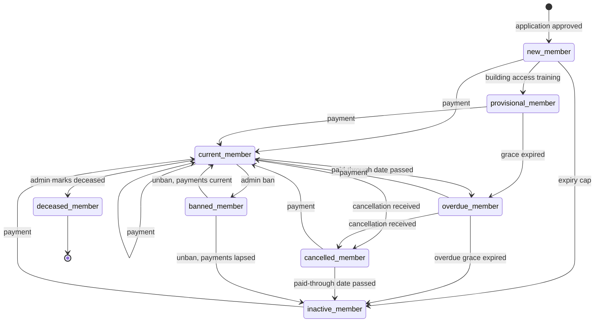

# Membership State Machine

A member's standing is one value: `users.membership_state`. Everything else about their
access — whether the door opens, what the member list shows, whether a reminder goes out —
is derived from it.

This document is the specification. If the code and this document disagree, one of them is
a bug.

---

## Where the logic lives

All of it is on `User`, split across four concerns so no single file outgrows RuboCop's
class-length limit:

| File | Responsibility |
| --- | --- |
| `app/models/concerns/membership_state.rb` | The enum, the `TRANSITIONS` table, the guard that enforces it, and the scopes |
| `app/models/concerns/membership_transitions.rb` | The transition methods (`approve_application!`, `record_payment!`, …) |
| `app/models/concerns/membership_state_resolution.rb` | Deadlines: what a state becomes when its clock runs out |
| `app/models/concerns/membership_state_projection.rb` | Rewriting the cached columns (`active`, `membership_status`, `dues_status`) |

`Membership::ActiveStatus` still exists as a thin adapter for older callers. It delegates;
it decides nothing.

Nothing outside `User` computes membership state. Controllers, jobs, rake tasks, and
webhook handlers call a transition method that names what happened. The UI reads state and
displays it.

---

## The states

| State | Access | Ends when |
| --- | --- | --- |
| `unknown` | No | An admin reconciles the import against a real membership |
| `new_member` | **Yes** | Building access training is granted, or `new_member_expiry_days` passes |
| `provisional_member` | **Yes** | They pay, or `new_member_grace_period_days` passes |
| `current_member` | **Yes** | `dues_paid_through_at` passes |
| `overdue_member` | **Yes** | They pay, or `overdue_grace_period_days` passes |
| `cancelled_member` | **Yes** | `dues_paid_through_at` passes |
| `inactive_member` | No | A payment lands |
| `guest_member` | **Yes** | `dues_due_at` passes, if one was set |
| `sponsored_member` | **Yes** | An admin removes the sponsorship |
| `banned_member` | No | An admin lifts the ban |
| `deceased_member` | No | Never — terminal |

`new_member` and `provisional_member` are both pre-payment states. The difference is that
a new member has not yet been trained on building access, so nothing is counting down
except the long expiry cap; a provisional member has been trained and is inside the short
grace window before their first payment is expected.

`unknown` is narrower than it sounds. It is the bootstrap value for a record nothing has
happened to yet, and where an unreconciled legacy import sits. It is *not* where a member
with no payment history goes — that member is inactive, which is the same conclusion
`state_from_payment_history` reaches when a ban or a sponsorship is lifted. A member
showing as undetermined who plainly just never paid is a data bug, not a state.

Members turn up in ways that say nothing about whether they pay: a Slack account, a name
on an unmatched badge scan, the first screen of the onboarding wizard. Those records start
at `User.initial_membership_state`, which reads the **Inactive synced as active** switch on
the member list. That switch is the admin saying whether MemberZone's ignorance should cost
somebody their access, so with it on a discovered member gets the onboarding window and with
it off they are created inactive. Either way a linked payment overrides it immediately.

There is deliberately no `applicant` state. A membership application is a
`MembershipApplication`, not a member, and it only becomes a `User` when an Executive
Director approves it — at which point `FinalizeApproval` creates the record and
`approve_application!` moves it straight to `new_member`. A rejected application never
produces a user at all.

`legacy`, `emergency_active_override`, and `is_sponsored` remain orthogonal boolean
columns, not states. Service accounts bypass the machine entirely: their `active` flag is
whatever an admin set, and nothing projects over it.



---

## Transitions

Each method names an event and returns `false` when the move does not apply — either
because the member is already there, or because `TRANSITIONS` forbids it. Callers should
check the result; a refused move is an ordinary answer, not an exception.

| Method | Event | Result |
| --- | --- | --- |
| `approve_application!` | An application is approved | `new_member` |
| `grant_building_access!` | Building access training recorded | `provisional_member` |
| `record_payment!(**attrs)` | A payment is linked | `current_member` |
| `record_cancellation!` | A cancellation notice arrives | `cancelled_member` |
| `ban!` | Admin bans | `banned_member` |
| `unban!` | Admin lifts a ban | Recomputed from payment history |
| `mark_deceased!` | Admin marks deceased | `deceased_member`, `payment_type: inactive` |
| `mark_sponsored!` | Admin sponsors | `sponsored_member`, `is_sponsored: true` |
| `unmark_sponsored!` | Sponsorship ends | Recomputed from payment history |
| `mark_guest!(duration_months:)` | Admin grants guest access | `guest_member` |
| `expire_membership_state!` | A deadline passed | Whatever the deadline leads to |

`unban!` and `unmark_sponsored!` both fall back to `state_from_payment_history`: current if
the member's payments still cover them, inactive otherwise. Never `unknown` — we know what
happened to them, and a member with nothing paying for them is inactive.

### Illegal transitions are refused, not raised

`TRANSITIONS` lists the legal moves out of each state, and `deceased_member` has no exits at
all. The rule is enforced in two places against the same predicate, `can_transition_to?`:

- **Transition methods** check it before assigning, in `transition_to!`, and return `false`.
  Callers ask for impossible moves routinely — a bulk action on a report row, a Recharge
  cancellation for someone we buried — so `ban!` on a deceased member is a question with the
  answer "no", not a 500.
- **Validation** catches everything else. A stray `update!(membership_state: …)` adds a
  validation error rather than saving, so nothing can silently corrupt someone's standing.

Two callers legitimately need to place a member anywhere: the admin edit form and data
backfills. Both set `allow_any_membership_state_transition = true` on the record first,
which lifts both checks.

Because a refusal is silent, anything with a UI has to look at the return value.
`UsersController` and `ReportsController` both flash the failure instead of reporting
success over a no-op.

---

## Deadlines

Three of the timed states run off `membership_state_entered_at`, stamped automatically
whenever the state changes. The rest run off `dues_paid_through_at`.

| State | Deadline |
| --- | --- |
| `new_member` | entered_at + `new_member_expiry_days` (default 90) |
| `provisional_member` | entered_at + `new_member_grace_period_days` (default 14) |
| `overdue_member` | entered_at + `overdue_grace_period_days` (default 30) |
| `current_member`, `cancelled_member`, `guest_member` | `dues_paid_through_at` |

`dues_paid_through_at` prefers `dues_due_at` when it is set. Members with no membership
plan never got one, so it falls back to their last payment plus the plan's billing window
(32 days by default). Nil means nothing is counting down: a one-time plan, or no payment
history to measure from.

### Resolved on read, materialized nightly

`effective_membership_state` applies elapsed deadlines every time it is called, chaining
through up to four hops so a provisional member whose grace ran out months ago resolves
through `overdue_member` to `inactive_member` in a single pass. `before_save` writes the
resolved state back, so any save fixes a stale row.

`User#active?` uses the same resolved state, so building access and Authentik sync stay
correct between runs even when the cached `active` column has drifted. Reports and member
list filters read the column directly; those counts catch up when the job runs.

`Membership::TickJob` runs daily at 4:00 AM, ahead of the payment syncs and reminders so
they see today's states. It materializes expiries into the column and reconciles any
`active` flag that has drifted from what the state implies. The logic lives in
`Membership::StateTick`, which the job, the preview rake task, and `membership:reconcile_active`
(all of which invoke the job) share. It is not what keeps access correct — read-time
resolution does that — but it is what makes the stored state match reality for reminders,
reports, and the member list, and what fires the state-entry email for members who fall
inactive.

---

## The projected columns

`active`, `membership_status`, and `dues_status` are rewritten from `membership_state` on
every save. They exist so queries, reports, and views written before the state machine keep
returning what they always returned.

**Do not assign them.** Anything you write is overwritten on the next save. Move the member
instead, with a transition method.

`membership_status` maps the state onto the old enum; note that members behind on dues stay
`paying` and are distinguished by `dues_status`, matching pre-state-machine behaviour.
`dues_status` maps onto `current` / `lapsed` / `inactive` / `unknown`.

`payment_type` is mostly not a projection — it records a real payment channel we learned from
a payment — but two states settle the question themselves and overwrite it: a sponsored member
pays by `sponsored` and a deceased one by `inactive`. Without that, a sponsored member whose
PayPal history turned up in a sync ended up filed under `paypal`, and one who had never paid
anything sat in the "Payment type unknown" report as though nobody were billing them by
mistake.

Plan-less payment windows also come from `MembershipSetting`: `planless_payment_window_days`
(default 32) and `payment_currency_buffer_days` (default 2, added to a plan's billing cycle).

New code should read `membership_state` and use the scopes:

```ruby
User.access_granting          # states that open the door
User.dues_lapsed              # overdue_member, inactive_member
User.dues_current             # new, provisional, current
User.membership_undetermined  # unknown
User.in_membership_states(%w[overdue_member cancelled_member])
```

---

## Email and reminders

Everything here goes through `QueuedMail`, which holds a message in the outbound review
queue unless its template opts out of review.

| Trigger | Template | Cadence |
| --- | --- | --- |
| Entering `cancelled_member` | `membership_cancelled` | Once, guarded by `membership_cancelled_email_sent_at` |
| `ban!` | `membership_banned` | Once per ban |
| Entering `inactive_member` | `membership_lapsed` | Once per lapse, **unless they cancelled** |
| Being in `overdue_member` | `payment_past_due` | Weekly, while the reminder is enabled |
| Being in `new_member` | `orientation_reminder` | Every `orientation_reminder_repeat_days`, while the reminder is enabled |
| `mark_deceased!` | — | No email |

The overdue reminder is a `ReminderSetting` keyed `payment_overdue`, **disabled by
default**. `PaymentOverdueReminderJob` runs daily at 7:30 AM and
`Reminders::PaymentOverdueEligibility` decides who is due: members whose resolved state is
still `overdue_member`, not reminded within `payment_overdue_reminder_repeat_days` (default
7), with an email address, no reminder already waiting in the queue, and not a service
account. Reading the resolved state rather than the column means a member whose overdue
grace has run out does not get one last nag on their way to inactive. Cancelled members are
excluded by design — they told us they were leaving — as are members with a cancellation on
file that has not been reconciled yet (see below).

The orientation reminder is a `ReminderSetting` keyed `orientation`, **disabled by default**.
`OrientationReminderJob` runs daily at 7:45 AM and `Reminders::OrientationEligibility` decides
who is due: members whose resolved state is still `new_member`, with no training recorded
against the building access topic, approved more than `orientation_reminder_repeat_days`
(default 14) ago and not reminded within that same window. `new_member` already means
"approved, nothing has granted building access yet", so recording the training ends the
reminders by moving the member to `provisional_member`; the training check is a backstop for
members who reached `new_member` already trained, where the transition never fired. Reading
the resolved state keeps the reminder off members whose `new_member_expiry_days` window has
run out — they are on their way to inactive, and booking an orientation is no longer the
point.

Members still waiting on their orientation are also left out of the dues-lapsed report:
somebody who was never let into the building is not a billing problem yet.

The cancellation email promises reactivation without reapplying within
`reactivation_grace_period_months` (default 12) and points anyone past that at the support
address.

### A cancellation outlives `cancelled_member`

`cancelled_member` is a waiting room. When the paid-through date passes, the member becomes
`inactive_member` — the same state as someone who quietly stopped paying — and the state
alone can no longer tell the two apart. Left there, the lapse email chases someone who
chose to leave, told us so, and was already told their access ran to a date that has now
arrived.

So the fact is kept separately from the state, on `users.membership_cancelled_at`:

- `record_cancellation!(cancelled_at:)` stamps it alongside the transition.
- `note_cancellation!(cancelled_at:)` stamps it for a member whose standing has nowhere to
  go — already lapsed, banned, dead. Nothing moves.
- `cancellation_recorded?` asks whether the stamp is set — the question for code deciding
  whether there is bookkeeping left to do.
- `cancellation_on_file?` is the broader question, and the one anything about to mail a
  member asks. It is true for the stamp **or** for an unprocessed `subscription_cancelled`
  payment event newer than the member's last payment. `notify_membership_lapsed` and
  `PaymentOverdueEligibility` both use it, because `Membership::TickJob` walks members from
  `overdue_member` to `inactive_member` without passing through `cancelled_member` — a
  filed notice nobody has reconciled yet has to be enough on its own.
- Entering any of `REJOINED_STATES` — `new_member`, `provisional_member`, `current_member` —
  clears it, along with `membership_cancelled_email_sent_at`. A member who came back is not a
  member who left, so a later lapse reads as a lapse and a second cancellation mails them
  again. A payment is the usual way back, but someone who lapsed and later reapplied is a
  member again from the moment their application is approved, before any money arrives; left
  on file, the old stamp would suppress the new membership's mail indefinitely. The clearing
  is bookkeeping rather than mail, so it happens even under
  `Current.skip_membership_state_email`.
- `overdue_member` does not clear it — that is the same membership falling behind, not a new
  one — and neither do `sponsored_member` or `guest_member`, which may end and leave the
  member exactly where the cancellation left them.

The membership card on the profile reads the stamp too. `member_cancellation_line` replaces
the card's "Next payment" line with "Cancelled / Active until *date*", because there is no
next payment coming and presenting the paid-through date as one — as a renewal, or once it
passes, as an overdue bill — asks the member for money they told us they were done paying.
The date is `dues_paid_through_at`, the day their last payment stops covering them. A
sponsorship or guest pass granted after the cancellation supersedes it and the ordinary line
returns.

The membership card on the profile reads the stamp too. `member_cancellation_line` replaces
the card's "Next payment" line with "Cancelled / Active until *date*", because there is no
next payment coming and presenting the paid-through date as one — as a renewal, or once it
passes, as an overdue bill — asks the member for money they told us they were done paying.
The date is `dues_paid_through_at`, the day their last payment stops covering them. A
sponsorship or guest pass granted after the cancellation supersedes it and the ordinary line
returns.

---

## Catching up on filed cancellations

Recharge has been telling us about cancellations since long before the state machine
existed. Each notice was filed as a `subscription_cancelled` payment event, but nothing
consumed it, so the member's standing never moved: they stayed `current_member`, went
`overdue_member` on their own clock, and collected past-due reminders for a membership they
had already ended.

`Membership::CancellationReconciler` walks the filed notices and plays each one forward
from the day it arrived rather than treating an old cancellation as today's news:

```bash
rake membership:preview_cancellations   # dry run — what would change
rake membership:process_cancellations   # apply
```

For each member it takes the most recent notice on file — an older one from a subscription
they already replaced says nothing about where they stand — and:

- Moves them to `cancelled_member` with `membership_state_entered_at` set to the
  cancellation date, then materializes any deadline that has since passed, so a member
  whose paid-through date ran out lands in `inactive_member` in the same pass.
- Withdraws `payment_past_due` mail still waiting in the review queue. An approved-but-unsent
  reminder is rejected too; `QueuedMailDeliveryJob` re-checks the status before sending.
- Suppresses state-entry email for the whole run via `Current.skip_membership_state_email`.
  Nobody should get "sorry to see you go" about a subscription they ended two years ago.

Members who lapsed long before anyone processed their notice have no state left to move —
`inactive_member` is where the cancellation would have put them anyway. They still get
`membership_cancelled_at` recorded, which is the whole point: it is the only thing that
stops the lapse email finding them.

It leaves alone anyone who paid or opened a new subscription after cancelling, anyone whose
cancellation is already recorded, service accounts, and the states a person chose
deliberately (`banned_member`, `deceased_member`, `sponsored_member`, `guest_member`).

Leaving a member's standing alone is not the same as deciding the notice was wrong, and the
two have different consequences for queued past-due mail. A member who came back keeps
their reminders — they may genuinely owe us again. Everyone else loses them: the
cancellation stands, there is simply no state left to change.

One case is deliberately not guessed at. `last_payment_on` is a date and the notice is a
timestamp, so a payment on the same calendar day is either a same-day resubscribe or the
renewal they cancelled straight afterwards, and the records cannot say which. Those members
are listed in the report for an admin to sort out by hand. Nothing chases them in the
meantime, because the mail guards read the payment event ledger directly.

The live path draws the same line, reading `NOTE_ONLY_STATES` from the reconciler so a
webhook and a later reconcile cannot disagree. `Recharge::SubscriptionCancellation` files
the payment event either way — the subscription really did end at Recharge — and then, when
`record_cancellation!` declines:

- A member already in `inactive_member` gets `membership_cancelled_at` stamped and nothing
  else, returning `:noted`. Skipping the stamp would leave the notice for a rake reconcile
  to find, and the lapse email chasing them until it ran.
- A `banned_member`, `deceased_member`, `sponsored_member`, or `guest_member` is left
  entirely alone, returning `:state_locked` with no journal entry, so a billing notice never
  overrides a decision a person made.

Both the event and the stamp are dated from the subscription's own `cancelled_at`, not from
when the notice was read.

Until a notice is reconciled, `PaymentOverdueEligibility` skips members whose most recent
cancellation is newer than their last payment. That keeps the reminders quiet if a webhook
goes missing and the sync's lookback window closes before anyone notices.

---

## Settings

Settings → Membership settings, stored on the `MembershipSetting` singleton:

| Setting | Default | Effect |
| --- | --- | --- |
| `new_member_grace_period_days` | 14 | How long a trained member has before their first payment is expected |
| `new_member_expiry_days` | 90 | How long an approved member who never trains stays active |
| `overdue_grace_period_days` | 30 | How long an overdue member keeps access |
| `payment_overdue_reminder_repeat_days` | 7 | Minimum gap between overdue reminders |
| `orientation_reminder_repeat_days` | 14 | Delay after approval before the first orientation reminder, and the gap between them |
| `reactivation_grace_period_months` | 12 | How long a lapsed member can resubscribe without reapplying |
| `building_access_training_topic_id` | — | Which training topic triggers `grant_building_access!` |

Building access used to be found by matching `LOWER(name) LIKE '%building access%'`, which
meant renaming the topic silently broke onboarding. It is now an explicit setting; if it is
unset, `Training` creation does not advance anyone out of `new_member`.

---

## Known gaps

- **Cancellation is only detected automatically for Recharge.** PayPal and Ko-fi send no
  cancellation signal, so a member who cancels there goes `overdue_member` →
  `inactive_member` and gets reminders on the way. Staff can record it by hand from the
  member page.
- **Recharge cancellations are reconciled on demand, not on a schedule.**
  `Recharge::SubscriptionSynchronizer` only looks back seven days, so a notice missed for
  longer needs `rake membership:process_cancellations`. The eligibility guard keeps the
  reminders quiet in the meantime, but the member's state stays wrong until it runs.
- **Revoking building access training does not move anyone back.** Payment state is
  independent of training, so a `current_member` who loses the training stays current.

---

## Working on this

- Move members with transition methods. Never assign `membership_state`, `active`,
  `membership_status`, or `dues_status` directly, and never reach for `update_columns` on
  them — it skips the guard, the stamp, and the projection all at once.
- In tests, put a member in a state by assigning `membership_state` on creation, or by
  calling the transition that gets them there. Setting `active: false` does nothing; it is
  recomputed on save.
- Adding a state means adding it to `STATES`, giving it a row and the relevant columns in
  `TRANSITIONS`, deciding whether it belongs in `ACCESS_STATES`, and adding both
  projections. The projection maps use `fetch` with a default, so a missed entry degrades
  to `unknown` rather than raising.
